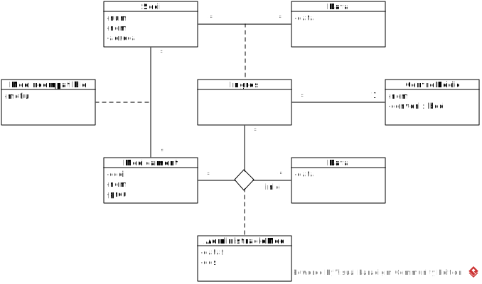
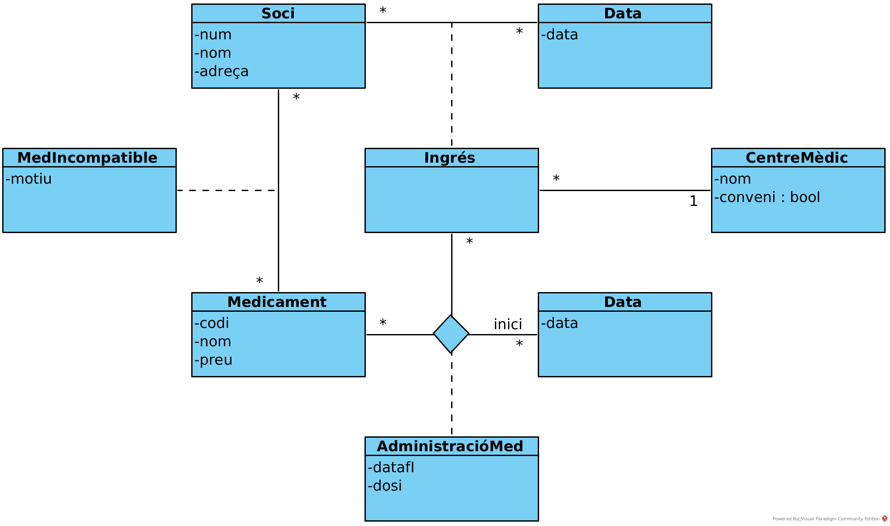

# 
 2on problema d’IES – 2 o 3 de març del 2023 – QP2223

Considereu una mútua sanitària que està interessada en un sistema pel control dels ingressos hospitalaris en què intervenen els seus socis. Un ingrés el té un soci determinat en un cert centre mèdic i ocorre en una certa data. La mútua identifica els seus **socis** pel seu número d'associat i n'enregistra també el seu nom i la seva adreça. Els **centres mèdics** són identificats pel seu nom i s'enregistren també la informació de si el centre té signat un conveni o no amb la mútua. És impossible que una mateixa persona tingui dos **ingressos** en *centres mèdics* en una mateixa *data*, encara que si que pot tenir diversos ingressos en dates diferents.

_Per exemple, la soci número 17 (nom Maria, adreça C/Diputació) va ser ingressada a l'hospital de Santa Maria del Mar (que no té conveni amb la mútua) el dia 8/8/2019._

El sistema guarda també informació dels possibles medicaments a administrar als pacients, que tenen un codi identificador, un nom i un preu unitari. Els ingressos que es fan a centres mèdics que no tenen conveni amb la mútua requereixen que al soci ingressat se li administrin un o més medicaments per a la seva curació. Per a cada administració d'un medicament a un d’aquests ingressos, s’haurà de conèixer també quin és el nombre diari d'unitats a administrar i la data d'inici i la data final d'administració. Un mateix medicament es pot administrar diverses vegades durant un mateix ingrés. El sistema no ha de guardar informació de les administracions de medicaments que es fan als ingressos fets a centres mèdics que tenen
conveni amb la mútua.

_Per exemple, com a conseqüència de l'ingrés anterior, la soci 17 va rebre tres medicaments. El medicament 3, en una quantitat de 3 unitats diàries, des del dia 8/8/2019 fins el 10/8/2019. El medicament 5, en una quantitat de 5 unitats diàries, des del dia 8/8/2019 fins el 11/8/2019. Finalment, una segona administració del medicament 3, en una quantitat de 7 unitats diàries, des del dia 12/8/2019 fins el 14/8/2019._

El sistema coneix també els medicaments que són incompatibles als socis. Un soci pot tenir més d'un medicament incompatible i s'enregistrarà, per cada medicament, el motiu de la incompatibilitat. Durant un ingrés, no es poden administrar a un soci medicaments que li són incompatibles.

_Per exemple, el medicament 33 és incompatible per a la soci 17 ja que conté penicil·lina._

Feu l’esquema conceptual d'aquest sistema en la notació UML. Expresseu gràficament totes les restriccions que pugueu. Les restriccions que no es poden expressar gràficament i les regles de derivació dels atributs derivats, si n’hi ha, especifiqueu-les textualment. Si us cal més informació, féu els supòsits que creieu més adients i indiqueu-los ben clarament.

 <!--
 
 -->
 

